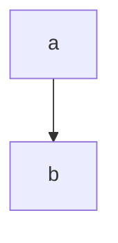

# unity-tutorial-unirx-
This is the project I used to understand UniRx.   
UniRxの学習の一環で作成したプロジェクトです
## UniRxとは
イベント処理などで使用される(繰り返し実行されるUI系統とか)。非同期処理も対応しているが、acync\awaitの方が便利なので使用されない

### Subject
Subjectとはメッセージを発行するソース  
Subscribeとは関数を登録する処理（購読）  
OnNextとは登録された関数を値を渡して実行する処理  
```
  Subject<string> _subject = new Subject<string>();


        _subject.Subscribe(text=>Debug.Log(text));


        _subject.OnNext("こんにちわ！");
```

### Operator
LINQの様にフィルタリングすることができる  
一覧：https://qiita.com/toRisouP/items/3cf1c9be3c37e7609a2f  
また一連の処理をストリームと呼ぶ  
```
  _subejct
        .Where(msg=>msg.Length<10)
        .Where(msg=>msg== "HelloWorld!")
            .Subscribe(msg=>Debug.Log(msg));
```

## 発行されるメッセージ  
・OnNext:通常のイベントが発生した際に通知  
・OnError:例外が発生した際に通知  
```
 Subject<string> _subject = new Subject<string>();


        _subject
           .Select(text=>int.Parse(text))
           .OnErrorRetry((FormatException ex)=>
            {
                Debug.Log("例外が発生したため、再購読します");
        })
           
          
            .Subscribe(text => Debug.Log("通常"+text)
            ,ex=>Debug.Log("例外:"+ex));

        //エラーを捕まえた場合は処理が途中で止まってしまう...
        _subject.OnNext("こんにちわ！");
        _subject.OnNext("111");
```
・OnCompleted:ストリーム（一連の処理）が終了した際に通知  
```
Subject<string> _subject = new Subject<string>();


        _subject.Subscribe(text=>Debug.Log(text)
        , ()=>Debug.Log("処理終了"));


        _subject.OnNext("こんにちわ！");
        //ストリームの終了通知（これ以降は購読通知をしない）
        _subject.OnCompleted();
```


# MV(R)Pパターン  
Web業界で使われているデザインパターン。クライアントが画面(UI)をよく操作することを前提としたデザインパターン。


##
参考にさせていただいた資料  
https://qiita.com/toRisouP/items/00b8a5bb8e7b68e0686c
